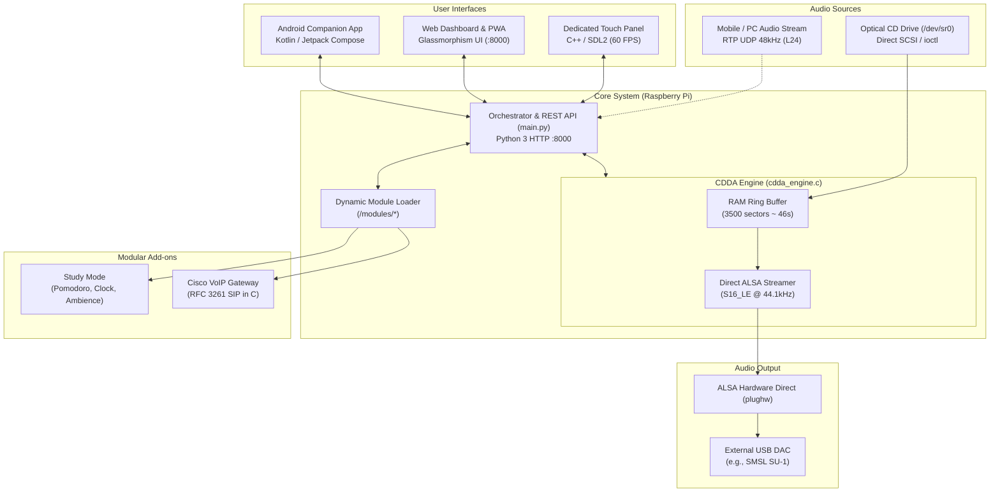

# Audiophile Raspberry Pi CD Player, Touch Panel & Modular Hi-Fi System

[](https://github.com/guits06/cdplayer/actions/workflows/ci.yml)
[](LICENSE)
[](https://www.raspberrypi.com/)
[](#audio-fidelity-and-dac-compatibility)
[](#system-architecture)

An open-source, bit-perfect CD Audio transport and player designed for Raspberry Pi, featuring a custom direct-SCSI C extraction engine, hardware-accelerated C++/SDL2 touchscreen panel, glassmorphism web dashboard, native Android companion application, desktop low-latency audio streaming client, and a game-style modular extension ("mods") system.

---

> [!NOTE]
> ### AI-Assisted Development Transparency and Refactoring Roadmap
> This project was conceptualized, architected, and prototyped with extensive assistance from **large language models and AI tools**. 
> AI accelerated parallel development across several domains: the low-level C SCSI/ioctl audio reader (`cdda_engine.c`), real-time RTP/UDP audio depacketizers, an RFC 3261 SIP/VoIP server in C, a hardware-accelerated SDL2/C++ touch panel, and a Jetpack Compose Android app.
>
> **Refactoring Roadmap:**
> There is an active intention and roadmap to audit, refine, and **progressively rewrite core subsystems by hand**. The goal is to eliminate typical AI verbosity and structural redundancies, enforce strict algorithmic minimalism, and establish a thoroughly hand-crafted, idiomatic codebase.

---

## Key Features

* **Bit-Perfect C Native Audio Engine**:
  * Direct block-level SCSI ioctl reading (`CDROMREADAUDIO`) implemented in `cdda_engine.c`.
  * **Circular RAM buffer of ~8.2 MB** (over 46 seconds of read-ahead) providing seamless playback and full resilience against optical drive vibrations or reading hiccups.
  * Direct ALSA hardware integration (`plughw`) outputting uncompressed 44,100 Hz / 16-bit stereo PCM with software mixers disabled (`dmix` bypassed).
* **Game-Style Modular Architecture ("Mods")**:
  * Completely decoupled extensions residing in the [`modules/`](modules/) directory.
  * **Zero mandatory dependencies**: The base player runs independently without any modules installed.
  * **Dynamic auto-detection**: Modules are discovered automatically at runtime via `module.json`.
  * Allows injecting custom UI widgets into both the web interface and the touchscreen panel.
  * *Bundled modules*: **Study Mode** (Pomodoro timer, flip clock, and background LoFi/white noise generator) and **Cisco VoIP Gateway** (lightweight RFC 3261 SIP gateway in C bridging Cisco 7940/7960 IP phones with Bluetooth mobile telephony).
* **Dedicated Hardware Touch Panel (`touch-panel/`)**:
  * Native C++ and SDL2 application running at 60 FPS with GPU acceleration.
  * Touch transport controls, circular interactive track scrub bar, album cover art, and track metadata.
  * **Horizontal swipe gesture**: Real-time diagnostic screen displaying active USB DAC metrics (sample rate, bit depth, clock mode, and ALSA status).
* **Modern Web Dashboard (Glassmorphism & PWA)**:
  * Embedded HTTP server on port `8000` with dark translucent UI.
  * Background metadata resolution via local CD-TEXT and MusicBrainz / Cover Art Archive.
  * Progressive Web App (PWA) support for mobile devices and a full-screen visualizer mode (`visualizer.html`).
* **Native Android Companion App (`android_app/`)**:
  * Full REST API remote control.
  * System audio capture (Android 10+) streaming lossless **PCM L24 (24-bit / 48 kHz RTP/UDP)** directly to the DAC.
* **Desktop PC Streamer (`pc_send/`)**:
  * Available as a PyQt6 application and standalone C++ binary.
  * Captures system audio on Linux (PulseAudio/PipeWire) and Windows (WASAPI Loopback) to use the Raspberry Pi DAC as a wireless high-res output device.

---

## System Architecture



---

## Audio Fidelity and DAC Compatibility

The system outputs an uncompressed digital audio stream. Playback behavior depends on the physical hardware clock capabilities of the connected USB DAC:

| DAC Model / Class | Clock & Chipset Architecture | CD Audio (44.1 kHz / 16-bit) | Bit-Perfect Status |
| :--- | :--- | :--- | :--- |
| **SMSL SU-1** *(Recommended)* | XMOS XU316 + AKM AK4493S (Dual independent crystal clocks) | Direct 44,100 Hz / 16-bit bit-for-bit transmission | **100% Bit-Perfect** |
| **Audiophile XMOS / ESS DACs** | Native crystal oscillators for 44.1 kHz and 48 kHz families | Direct 44,100 Hz transmission | **100% Bit-Perfect** |
| **Snowsky Echo Mini / UAC1 Dongles** | Fixed single 48,000 Hz hardware USB clock | Resampled by ALSA (44.1 kHz to 48 kHz) | **Non Bit-Perfect** *(hardware limitation of DAC controller)* |

> [!TIP]
> Live playback parameters can be verified directly from the ALSA kernel interface:
> ```bash
> cat /proc/asound/card*/pcm0p/sub0/hw_params
> ```
> When paired with a dual-clock DAC like the **SMSL SU-1**, output parameters report `rate: 44100` and `format: S16_LE` with zero software resampling.

---

## Modular Extension System ("Mods")

All extensions live inside the [`modules/`](modules/) folder:

```text
modules/
├── study_mode/            # Study tools: Pomodoro, clock, ambient audio
│   ├── module.json        # Extension manifest
│   ├── study_backend.py   # Auxiliary audio background service
│   ├── ui.html / ui.js    # Injected web elements
│   └── panel_plugin.cpp   # Compiled plugin for the touch panel
└── cisco_voip/            # Cisco 7940/7960 IP phone telephony
    ├── module.json        # Manifest specifying telephony capability
    ├── cisco_gateway.c    # Micro SIP server (<2MB RAM)
    └── Makefile
```

### Module Manifest Specification (`module.json`)
```json
{
  "id": "my_module",
  "name": "My Extension",
  "version": "1.0.0",
  "description": "Custom features for the player.",
  "author": "Your Name",
  "icon": "box",
  "capabilities": ["telephony"],
  "service": "my-service",
  "web": {
    "enabled": true,
    "port": 8088,
    "label": "Web Access"
  }
}
```
Modules are detected automatically by `main.py` without modifying or rebuilding core player components.

---

## Bill of Materials (BOM)

To build a standalone unit equivalent to commercial Hi-Fi transports:

1. **Single Board Computer**: Raspberry Pi 3B+, 4B, or 5 running Raspberry Pi OS Lite (64-bit).
2. **Optical Drive**: External USB CD/DVD-RW drive (e.g., Hitachi-LG, ASUS).
3. **USB DAC**: **SMSL SU-1** recommended (AKM AK4493S with XMOS XU316 asynchronous USB).
4. **Touchscreen Display (Optional)**: 800x480 capacitive IPS display (e.g., Waveshare 4" or 5" DSI/HDMI).
5. **Power Supply**: 5V 3A USB-C supply (use an externally powered USB hub if the optical drive draws >1A during spin-up).

---

## Installation and Deployment

### 1. Clone the repository
```bash
git clone https://github.com/guits06/cdplayer.git
cd cdplayer
```

### 2. Configure Target Environment (Optional)
When using the automated deployment script (`./deploy.sh`), specify the target host in `.env`:
```bash
PI_HOST="root@raspberrypi.local"
DEST_DIR="/home/pi/cdplayer"
PANEL_DIR="/home/pi/panel"
```

### 3. Install System Packages on the Raspberry Pi
```bash
sudo apt update
sudo apt install -y \
  build-essential \
  gcc g++ make \
  libasound2-dev alsa-utils \
  libsdl2-dev libsdl2-ttf-dev libsdl2-image-dev \
  libcurl4-openssl-dev \
  python3 eject cd-info
```

### 4. Build and Deploy
Deploy local source files and compile automatically via SSH:
```bash
./deploy.sh
```

### 5. Systemd Services
Core components run as background systemd services:
* `cdplayer.service`: Web server, C audio engine, and module orchestrator.
* `cdpanel.service`: Hardware-accelerated SDL2 touchscreen user interface.

```bash
sudo systemctl status cdplayer
sudo systemctl status cdpanel
```

---

## REST API Reference (`Port 8000`)

| Method | Endpoint | Parameters / Body | Description |
| :--- | :--- | :--- | :--- |
| `GET` | `/api/status` | - | Real-time state (current track, duration, elapsed time, DAC name, buffer fill). |
| `GET` | `/api/modules` | - | List of all installed modules and their active/inactive status. |
| `POST` | `/api/modules/toggle` | `{"id": "study_mode", "enabled": true}` | Dynamically enable or disable a module and its service. |
| `POST` | `/api/play` | `{"track": 1}` | Start playing a specific track. |
| `POST` | `/api/pause` | - | Pause playback while retaining RAM buffer position. |
| `POST` | `/api/resume` | - | Resume playback instantly from paused position. |
| `POST` | `/api/stop` | - | Stop playback and release the ALSA device. |
| `POST` | `/api/seek` | `{"position": 125.5}` | Seek to a specific timestamp within the current track. |
| `POST` | `/api/next` | - | Advance to next track. |
| `POST` | `/api/prev` | - | Skip to previous track. |
| `POST` | `/api/eject` | - | Unlock and open the optical drive tray. |

---

## Companion Clients

### Android Application (`android_app/`)
* Built with **Gradle 8+ / Kotlin 2+ / Jetpack Compose**.
* Captures internal phone audio and streams lossless RTP L24 directly to the DAC.
* Compile debug build:
  ```bash
  cd android_app
  ./gradlew assembleDebug
  ```

### Desktop Audio Streamer (`pc_send/`)
* Precompiled standalone binaries (`rpi_streamer_windows.exe` and `rpi_streamer_linux`) are published on every push to `main` and downloadable from [GitHub Releases](https://github.com/guits06/cdplayer/releases).
* Redirects system audio to the Raspberry Pi over the local network:
  ```bash
  # Linux
  ./rpi_streamer_linux raspberrypi.local 3000

  # Windows
  .\rpi_streamer_windows.exe raspberrypi.local 3000
  ```
* A PyQt6 graphical interface (`pc_send/pc_audio_sender.py`) is also provided.

---

## Contributing

Contributions, bug reports, and refactoring PRs are welcome. Please ensure all code passes GitHub Actions CI tests before submitting pull requests.

1. Fork the repository.
2. Create your branch (`git checkout -b feature/improvement`).
3. Commit your changes (`git commit -m 'feat: add feature'`).
4. Push to the branch (`git push origin feature/improvement`).
5. Open a Pull Request.

---

## License

This project is licensed under the **MIT License**. See the [LICENSE](LICENSE) file for details.
