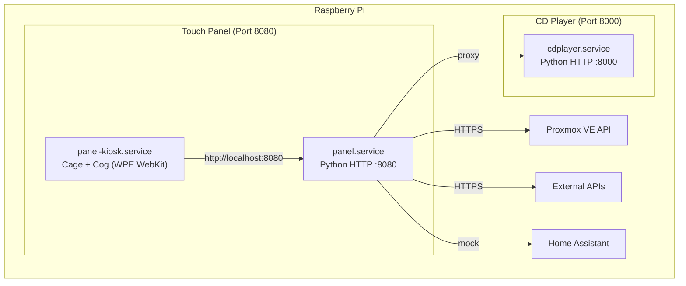

# Touchscreen User Interface for Raspberry Pi

A lightweight, dedicated touch interface designed for Raspberry Pi with a 5" (800x480) display and Catppuccin Mocha theme. Operates alongside the bit-perfect CD player service (`cdplayer.service`) without compromising audio streaming performance.

---

## Architecture and Components



- **Graphical Kiosk**: **Cage** (minimalist Wayland compositor, ~15 MB RAM) + **Cog** (embedded WPE WebKit launcher with GPU acceleration, ~60-90 MB RAM).
- **Native Alternative**: C++ / SDL2 native application (`cdpanel.cpp`) running directly against DRM/KMS.
- **Backend**: Python 3 HTTP server (`panel_server.py`) on port 8080.
- **Connector Pattern**: Decoupled integration modules in `connectors/` for clean API isolation.
- **Visual Theme**: **Catppuccin Mocha** high-contrast dark palette.

---

## Views Included

1. **CD Player**: Playback state, animated cover view, current track, and touch transport controls.
2. **Proxmox VE**: Real-time cluster status, CPU/RAM utilization, uptime, VM and LXC state.
3. **Personal Dashboard**: Aggregated external metrics.
4. **Home Assistant**: Control for lights and smart switches.

---

## Deployment

### 1. Deploy files to Raspberry Pi
```bash
./touch-panel/deploy.sh
```

### 2. Install kiosk dependencies (run once on Raspberry Pi)
```bash
ssh root@raspberrypi.local "/home/pi/panel/setup-kiosk.sh"
```

### 3. Start kiosk service
```bash
ssh root@raspberrypi.local "systemctl start panel-kiosk"
```

---

## Directory Structure

```text
touch-panel/
├── cdpanel.cpp                # Native C++/SDL2 touchscreen UI
├── panel_server.py            # Python backend server (:8080)
├── config.example.json        # Template configuration
├── connectors/                # API connectors
│   ├── base.py                # Abstract BaseConnector class
│   ├── cdplayer.py            # CD Player proxy (:8000)
│   ├── proxmox.py             # Proxmox VE connector
│   ├── personal_api.py        # External API connector
│   └── homeassistant.py       # Home Assistant connector
├── static/                    # Frontend SPA
│   ├── index.html             # Main HTML view
│   ├── style.css              # Catppuccin Mocha styles
│   ├── app.js                 # Router & Swipe Controller
│   ├── keyboard.js            # Virtual on-screen keyboard
│   └── pages/                 # View controllers
│       ├── cdplayer.js
│       ├── proxmox.js
│       ├── dashboard.js
│       └── homeassistant.js
├── cdpanel.service            # Systemd service for native C++ UI
├── panel.service              # Systemd service for Python backend
├── panel-kiosk.service        # Systemd service for Cage+Cog kiosk
├── setup-kiosk.sh             # Raspberry Pi package installer
└── deploy.sh                  # Deployment script
```
